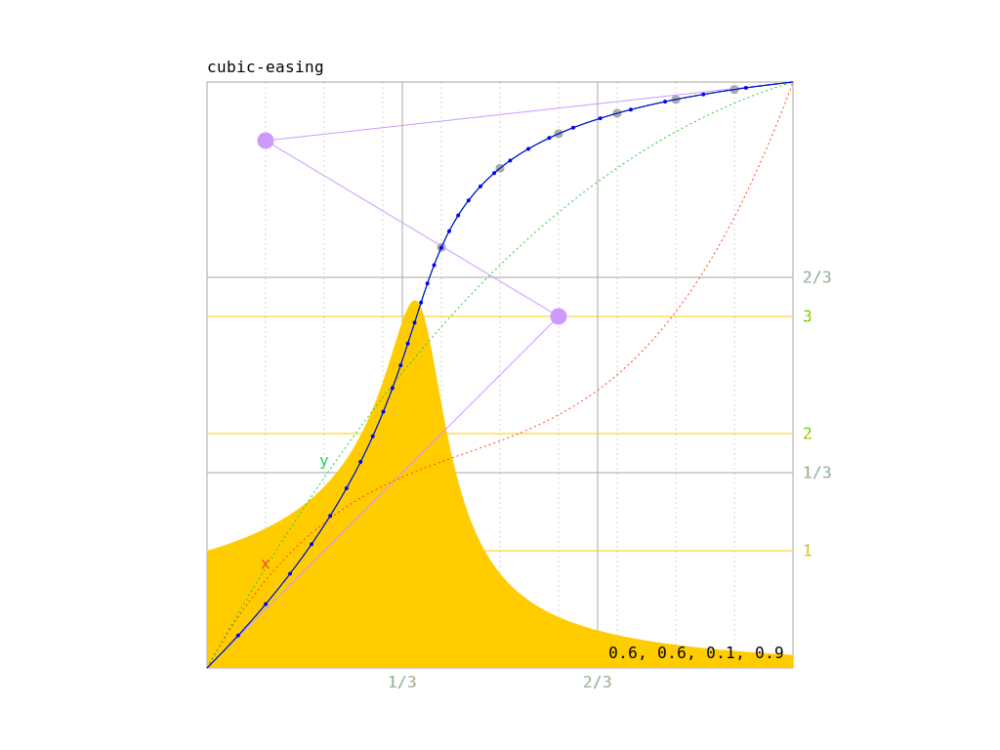

# js-bezier

WIP!

Stuff for bezier interpolation (1D, 2D, 3D, easing, derivative (first & second)).

[index.html](https://jniac.github.io/js-bezier/)

## links
https://en.wikipedia.org/wiki/B%C3%A9zier_curve#Cubic_B%C3%A9zier_curves
http://mrcslws.com/blocks/2015/02/26/using-bezier-curves-as-easing-functions.html
https://github.com/gre/bezier-easing/